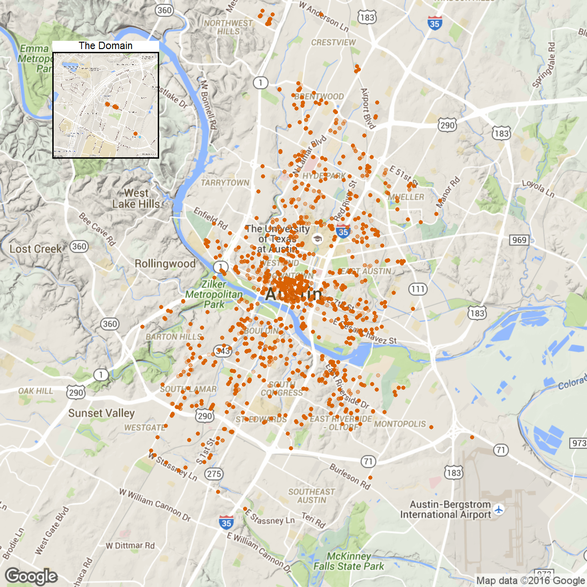
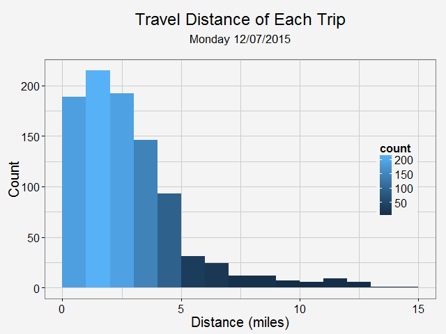
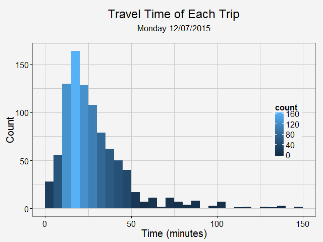
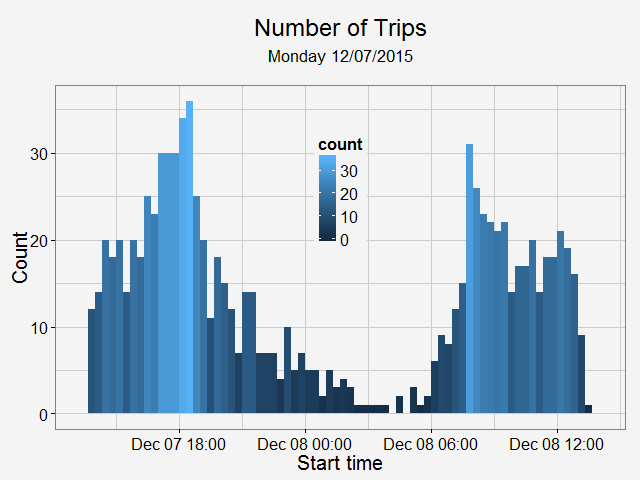
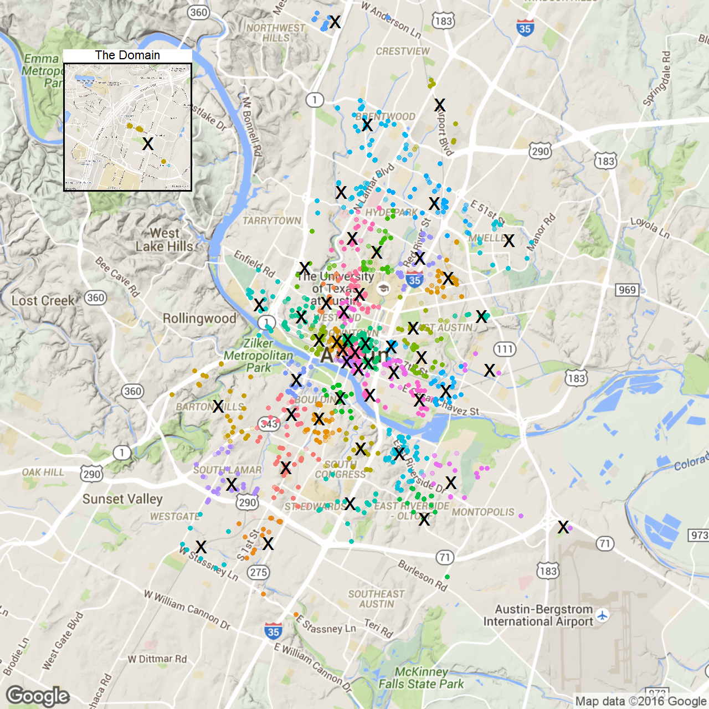
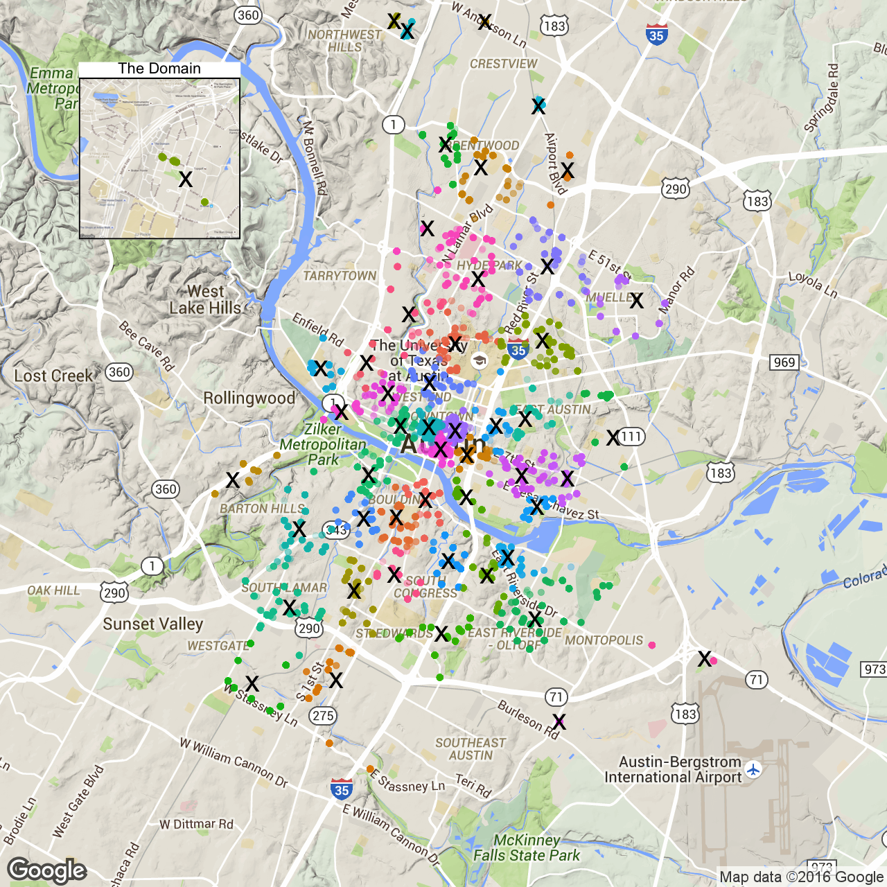
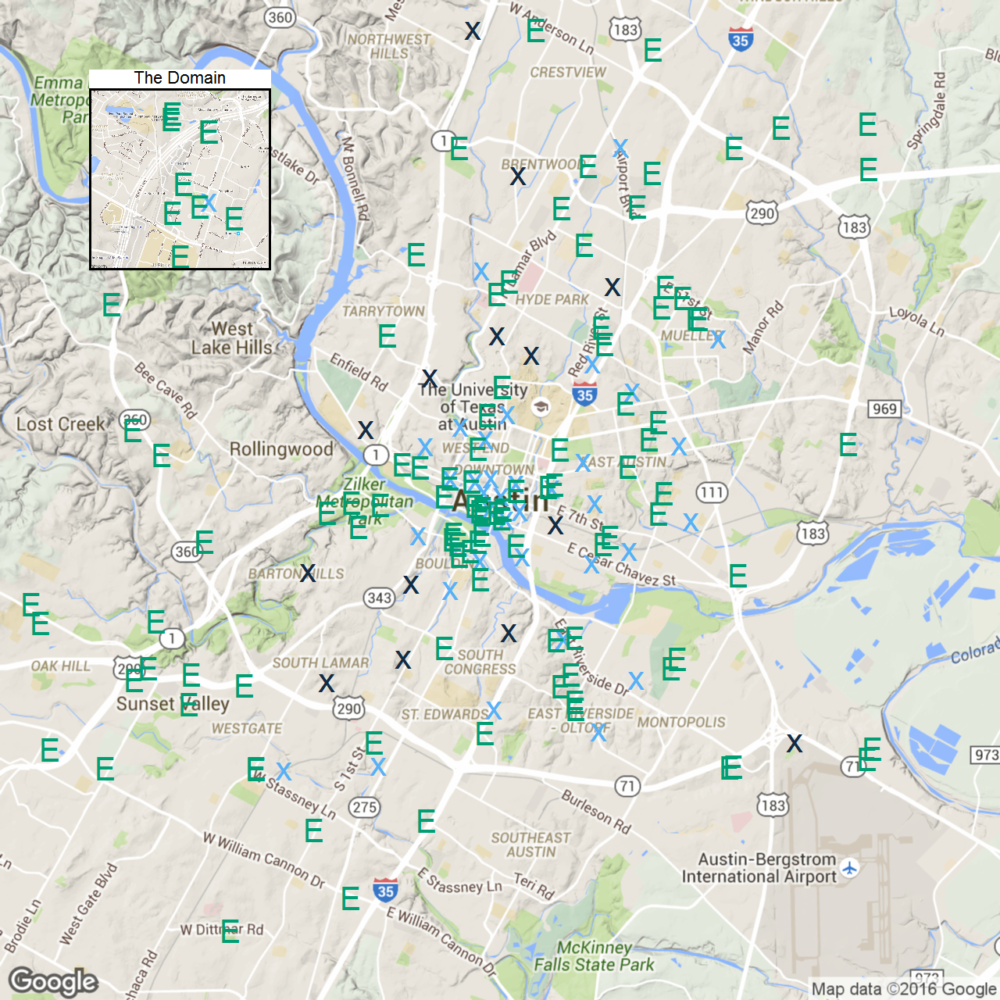

```{r setup, include=FALSE}
knitr::opts_chunk$set(echo = TRUE)
```

## Data scraping

```{r, eval=FALSE}
library(jsonlite)

for (day in 1:7){
  car.df.time <- data.frame()
  
  for (i in 1:288)){
    car.df <- data.frame()
    city = "austin"
    car2goURL <- paste('https://www.car2go.com/api/v2.1/vehicles?loc=', city, '&oauth_consumer_key=car2gowebsite&format=json', sep = '' )
    #import from JSON
    car2goData <- fromJSON(txt = car2goURL)
    
    #unlist and save
    coord <- data.frame(matrix(unlist(car2goData[[1]][2]), ncol=3, byrow = T))
    car.df.raw <- data.frame(matrix(unlist(car2goData[[1]]), ncol=11, byrow = F), City = city)[c(-2, -3, -4)]
    car.df.raw <- cbind(car.df.raw[,1], charging = NA, car.df.raw[,2:9], coord)
    colnames(car.df.raw) <- c(colnames(car2goData[[1]])[1], 'charging', colnames(car2goData[[1]])[3:9], 'City', 'Longitude', 'Latitude', 'Altitude')
    #add timestamp
    car.df <- data.frame(rbind(car.df, car.df.raw), Time = Sys.time())
    }
    car.df.time <- rbind(car.df.time, car.df)
    print(Sys.time())
    Sys.sleep(299)
  }
  
  car.df.time$fuel <- as.numeric(as.character(car.df.time$fuel))
  write.csv(car.df.time, file = paste('data/', day, '_Timedcar2go_week.csv', sep = ''))
}
```

## Raw data

```{r, cache=TRUE, warning=FALSE, message=FALSE}
library(ggplot2)
library(ggmap)
library(dplyr)
library(grid)
library(broom)
source('decodeLine.R')
source('init.R')

time.df <- read.csv('data/1Timedcar2go_week.csv', header = T)
head(time.df)

```
```{r, cache=TRUE, warning=FALSE, message=FALSE, eval=FALSE}
p1<- ggmap(get_map(location = 'austin', zoom = 12), extent = 'device')+ 
  geom_point(aes(x = Longitude, y = Latitude), data = time.df, alpha = 0.1, color = '#D55E00', size = 4) +
  theme(legend.position = 'none')
p1.2<- ggmap(get_map('domain, austin', zoom = 15), extent = 'device')+
  geom_point(aes(x = Longitude, y = Latitude), data = time.df, alpha = 0.1, color = '#D55E00', size = 4) +
  ggtitle('The Domain')+
  theme(legend.position = 'none', 
        plot.title = element_text(size = rel(2)),
        panel.border = element_rect(colour = "black", fill = NA, size=2))

plot_inset <- function(name, p1, p2){
  png(name, width=1280, height=1280)
  grid.newpage()
  v1<-viewport(width = 1, height = 1, x = 0.5, y = 0.5) #plot area for the main map
  v2<-viewport(width = 0.2, height = 0.2, x = 0.18, y = 0.83) #plot area for the inset map
  print(p1,vp=v1) 
  print(p2,vp=v2)
  dev.off()  
}

plot_inset('plots/1.png', p1, p1.2)
```
<div style="width:480px; height=360px">

</div>
## Visualize routes
### Data cleaning 
```{r, eval=FALSE}
car.first.app <- subset(time.df, !duplicated(time.df[, c(-1,-15)], fromLast = F))
car.first.app <- car.first.app[duplicated(car.first.app[, 8]) | duplicated(car.first.app[, 8], fromLast = T),]

car.last.app <- subset(time.df, !duplicated(time.df[, c(-1,-15)], fromLast = T))
car.last.app <- car.last.app[duplicated(car.last.app[, 8]) | duplicated(car.last.app[, 8], fromLast = T),]

car.name <- as.character(unique(car.first.app$name))
car.route <- data.frame()
trip.info <- data.frame()

for (name in car.name){
  
  car.single <- car.first.app[car.first.app$name == name,]
  car.single.last <- car.last.app[car.last.app$name == name,]
  
  car.route.single <- data.frame()
  trip.single <- data.frame()
  
  for (trip.ct in 1:(nrow(car.single)-1)){  
    
    car.route.all <- route(from = c(car.single[trip.ct, 12], car.single[trip.ct, 13]) , 
                            to = c(car.single[trip.ct+1, 12], car.single[trip.ct+1, 13]), structure = 'route', mode = 'driving',
                            output = 'all')
    
    car.route.temp <- decodeLine( car.route.all$routes[[1]]$overview_polyline$points )
    car.route.single <- rbind(car.route.single, data.frame(car.route.temp, startTime = car.single.last$Time....Sys.time..[trip.ct]))
    trip.single.temp <- data.frame(name = name, Dist = car.route.all$routes[[1]]$legs[[1]]$distance$value, 
                                   Fuel = car.single$fuel[trip.ct]-car.single$fuel[trip.ct+1], 
                                   Time = as.numeric(difftime(car.single$Time....Sys.time..[trip.ct+1], car.single.last$Time....Sys.time..[trip.ct], units = "mins")),
                                   startTime = car.single.last$Time....Sys.time..[trip.ct]
                                   )
    trip.single <- rbind(trip.single.temp, trip.single)
  }
  car.route <- rbind(car.route, data.frame(car.route.single, name = name))
  trip.info <- rbind(trip.single, trip.info)
}
#output files
write.csv(car.route, file = 'data/Mondayroutetime.csv')
write.csv(trip.info, file = 'data/Mondaytrip.csv')
```
### Time lapse

```{r, eval=FALSE}
car.route <- read.csv('data/Mondayroutetime.csv', header = T)
map <- get_map(location = 'austin', zoom = 12)
car.route.hour <- car.route %>%
  mutate(hour = as.numeric(format(as.POSIXct(startTime), '%H'))) 

for (i in 0:23){
  car.route.sub <- car.route.hour %>%
    filter(hour == i)
  plot <- ggmap(map) + geom_path(aes(x = lon, y = lat, group = name), size = 1, data = car.route.sub, lineend = 'round', alpha = 0.5, color = '#D55E00') + 
    annotate("text", x = -97.8, y = 30.33, label = paste0(i, ":00 -", i+1, ":00"), size = 8) + 
    theme_tws_map() + theme(legend.position="none",axis.title = element_blank())
  png(paste0('plots/', i, '-', i+1 , '.png'), width=640, height=640)
  print(plot)
  dev.off()
}
```
<div style="width:480px; height=360px">

</div>

## Trip stats

```{r, cache=TRUE, warning=FALSE, message=FALSE, eval=FALSE}
trip.info <- read.csv('data/Mondaytrip.csv', header = T)
#plot trip info
plot.dist <- ggplot(data=trip.info, aes(trip.info$miles)) + 
  geom_histogram(aes(fill = ..count..), breaks=seq(0, 15, by = 1) ) + 
  title_with_subtitle("Travel Distance of Each Trip", 'Monday 12/07/2015') +
  labs(x="Distance (miles)", y="Count") +
  theme_tws(base_size = 20) + theme(legend.position=c(0.9, 0.5))

png('plots/dist.png', width=640, height=480)
print(plot.dist)
dev.off()

plot.time <- ggplot(data=trip.info, aes(trip.info$Time)) + 
  geom_histogram(aes(fill = ..count..), binwidth = 5, breaks=seq(0, 150, by = 5)) + 
  title_with_subtitle("Travel Time of Each Trip", 'Monday 12/07/2015') +
  labs(x="Time (minutes)", y="Count") +
  theme_tws(base_size = 20) + theme(legend.position=c(0.9, 0.5))

png('plots/time.png', width=640, height=480)
print(plot.time)
dev.off()

plot.start <- ggplot(trip.info, aes(x=as.POSIXct(startTime))) + geom_histogram(aes(fill = ..count..),binwidth=1200) +
  title_with_subtitle("Number of Trips", 'Monday 12/07/2015') +
  labs(x="Start time", y="Count") +
  theme_tws(base_size = 20) + theme(legend.position=c(0.5, 0.7))

png('plots/start.png', width=640, height=480)
print(plot.start)
dev.off()
```
<table> 
<tr>
<td>  </td>
<td>  </td>
<td>  </td>
</tr>
</table> 

## EV charging stations
```{r, eval=FALSE}
#50 charging station
clust <- time.df %>% select(Longitude, Latitude) %>% kmeans(50, iter.max=500)
#Manhattan Distance
#library(amap)
#clust <-time.df %>% select(Longitude, Latitude) %>% Kmeans(50, iter.max=500, method="manhattan")
p3<- ggmap(get_map(location = 'austin', zoom = 12), extent = 'device')+
  geom_point(data=augment(clust, time.df),
             aes(x = Longitude, y = Latitude, color = .cluster), alpha =0.1, size = 4) +
  geom_point(aes(Longitude, Latitude), data = data.frame(clust$centers), size = 15, shape = 'x') + 
  theme(legend.position = 'none')

p3.2<- ggmap(get_map('domain, austin', zoom = 15), extent = 'device')+
  geom_point(data=augment(clust, time.df),
             aes(x = Longitude, y = Latitude, color = .cluster), alpha =0.1, size = 4) +
  geom_point(aes(Longitude, Latitude), data = data.frame(clust$centers), size = 15, shape = 'x') + 
  ggtitle('The Domain')+
  theme(legend.position = 'none', 
        plot.title = element_text(size = rel(2)),
        panel.border = element_rect(colour = "black", fill = NA, size=2))

plot_inset('3.png', p3, p3.2)
```
<table> 
<tr>
<td> Euclidean Distance </td>
<td> Manhattan Distance </td>
</tr>
<tr>
<td>  </td>
<td>  </td>
</tr>
</table> 
### Existing EV charging stations
```{r, eval=FALSE}
station.df <- read.csv('data/charging_stations (Feb 20 2016).csv', header = T)
station.austin <- station.df %>% filter(City=='Austin')

station.dist <- mutate(data.frame(clust$centers), distToExist= 0)
for (i in 1:nrow(station.dist)){
  # In the area of Austin, one dgree in Latitude is 69.1 miles, 
  # while one degree in Longitude is 59.7 miles
  d <- sqrt(((station.austin$Latitude-station.dist$Latitude[i])*69.1)**2 
            +((station.austin$Longitude-station.dist$Longitude[i])*59.7)**2)
  station.dist$distToExist[i] <- min(d)
}

p5 <-ggmap(get_map(location = 'austin', zoom = 12), extent = 'device')+
  geom_point(aes(Longitude, Latitude, color = -sign(distToExist-0.5)), 
             data = station.dist, size = 15, shape = 'x') + 
  geom_point(aes(x = Longitude, y = Latitude), data = station.austin, 
             size = 14, shape = 'E', color = '#009E73') +
  theme(legend.position = 'none')

p5.2<- ggmap(get_map('domain, austin', zoom = 15), extent = 'device')+
  geom_point(aes(Longitude, Latitude, color = -sign(distToExist-0.5)), 
             data = station.dist, size = 15, shape = 'x') + 
  geom_point(aes(x = Longitude, y = Latitude), data = station.austin, 
             size = 14, shape = 'E', color = '#009E73') +
  ggtitle('The Domain')+
  theme(legend.position = 'none', 
        plot.title = element_text(size = rel(2)),
        panel.border = element_rect(colour = "black", fill = NA, size=2))

plot_inset('5.png', p5, p5.2)
```
<div style="width:480px; height=360px">

</div>